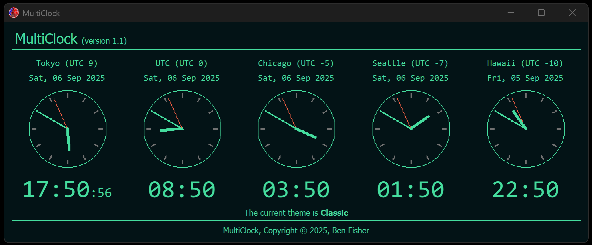

# MultiClock

Application that allows the user to add or remove clocks for multiple timezones. Please note, the images and icons are Copyright (C) 2023, Ben Fisher, All Rights Reserved.


I have also created a version with analog clocks, which has a horizontal layout. You'll need to run pyinstaller to create an EXE for this verion; it's not included in the dist folder.




## Editing Clocks

Simply edit the 'clocks' dictionary in the multiclocks.py. The keys are the display names for the clocks, whereas the values must be the **pytz timezone** list (<a href="https://en.wikipedia.org/wiki/List_of_tz_database_time_zones" target="_blank">IANA list</a>)

## Compile

You can compile using **pyinstaller** with ```pyinstaller --onefile -w --icon "{absolute icon.ico path}" multiclock.py``` to create an .exe. Alternatively download the [EXE](/dist/) in the dist folder.