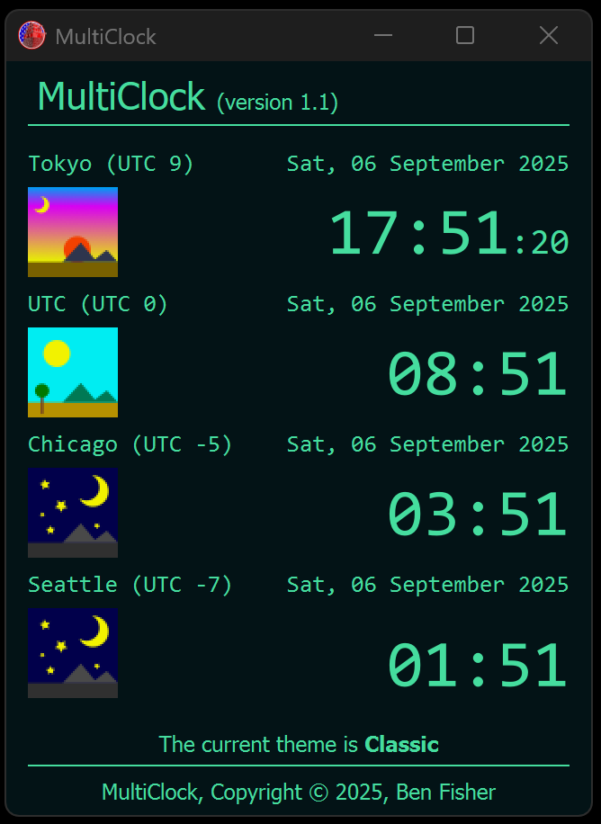

# MultiClock

Application that allows the user to add or remove clocks for multiple timezones. 

## Editing Clocks
Simply edit the 'clocks' dictionary in the multiclocks.py. The keys are the display names for the clocks, whereas the values must be the **pytz timezone** list (<a href="https://en.wikipedia.org/wiki/List_of_tz_database_time_zones" target="_blank">IANA list</a>)
